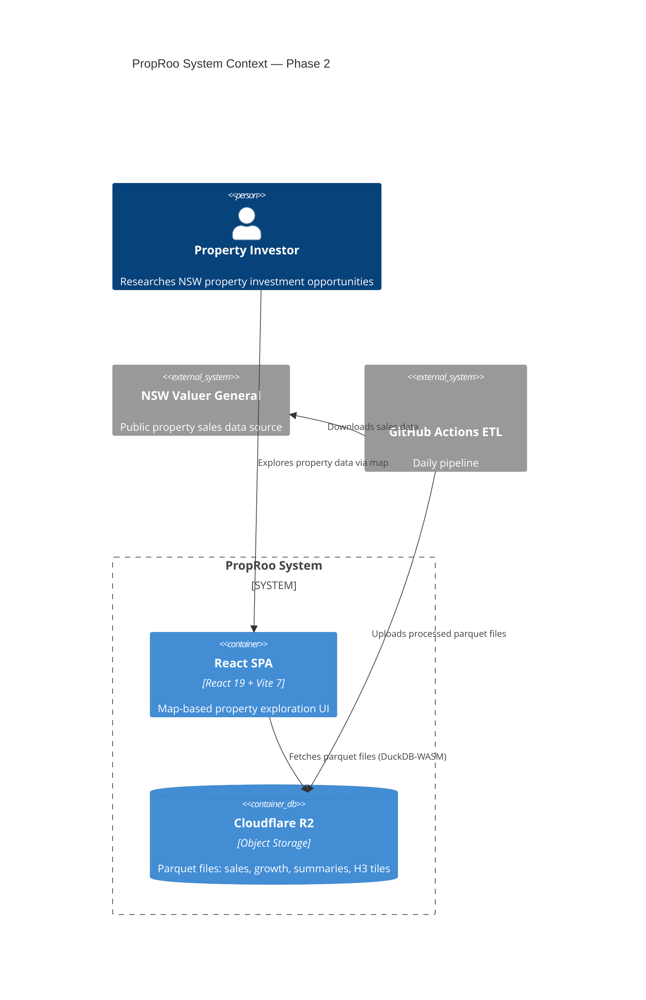
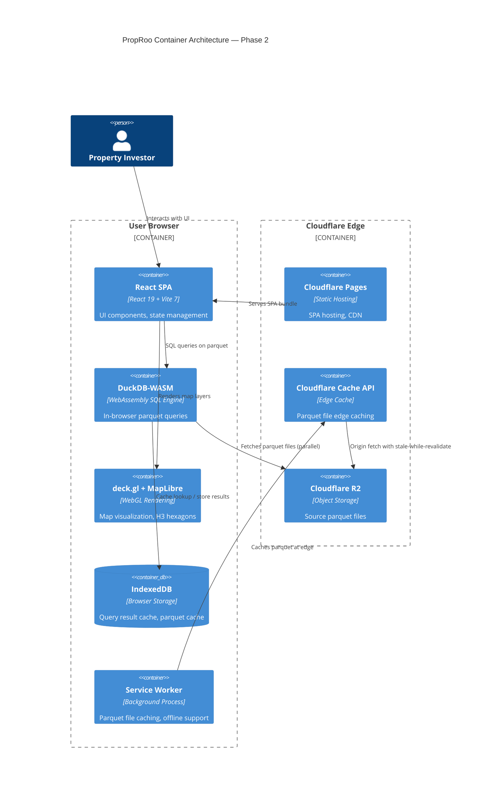
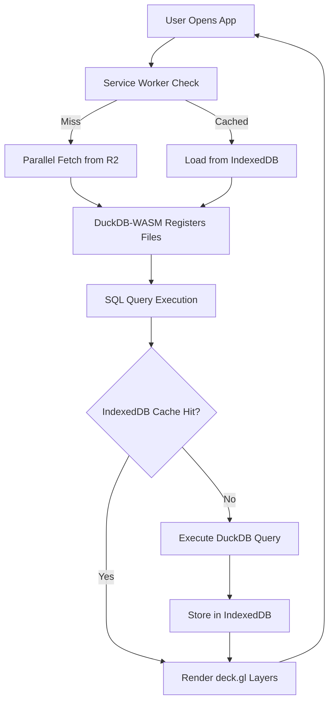

# PropRoo Architecture — Phase 2: UI/Performance Redesign

**Date**: 2026-04-05
**Status**: In Progress
**PR**: TBD

---

## System Context (C4 Level 1)



## Container Architecture (C4 Level 2)



## Data Flow



## Key Architecture Decisions

### ADR-001: Pure Frontend Architecture
**Decision**: No backend server. All data processing happens in-browser via DuckDB-WASM.
**Rationale**: Eliminates server costs, reduces latency, scales infinitely via CDN.
**Trade-offs**: Initial load is 34MB (mitigated by caching), limited by browser memory.

### ADR-002: IndexedDB Query Caching
**Decision**: Cache DuckDB query results in IndexedDB with TTL tiers.
**Rationale**: Avoids re-running expensive aggregations on filter changes.
**TTL Tiers**: Street summary (7d), Suburb summary (24h), Sales data (1h), H3 tiles (7d).

### ADR-003: Parallel Parquet Loading
**Decision**: Load all parquet files simultaneously via HTTP/2 multiplexing.
**Rationale**: Reduces initial load from ~30s to ~8s.

### ADR-004: 80/20 Layout with Sidebar Table
**Decision**: Map takes 80% of entire app, sidebar (20%) contains charts + scrollable table.
**Rationale**: Map is the primary exploration tool. Table supports, doesn't compete.

### ADR-005: shadcn/ui Design System
**Decision**: Adopt shadcn/ui components with OKLCH color tokens.
**Rationale**: Consistent design language, dark-mode optimized, copy-paste components.

## Performance Targets

| Metric | Current | Target | Method |
|--------|---------|--------|--------|
| Initial load | ~30s | <8s | Parallel loading + edge cache |
| Repeat visit | ~30s | <2s | IndexedDB + Service Worker |
| Query response | ~2s | <200ms | IndexedDB query cache |
| Map FPS | 30-45 | 60 | deck.gl memoization |
| Bundle size | 1.8MB | <1MB | Code splitting + tree shaking |

## File Structure (New)

```
frontend/src/
├── components/
│   ├── Dashboard.tsx          # Main layout (80/20 split)
│   ├── Map/
│   │   ├── PropRooMap.tsx     # deck.gl map with optimized layers
│   │   ├── LayerControls.tsx  # Floating layer toggle panel
│   │   └── TimeSlider.tsx     # Year slider component
│   ├── Sidebar/
│   │   ├── Sidebar.tsx        # 20% sidebar container
│   │   ├── CAGRChart.tsx      # Top CAGR bar chart
│   │   └── DataTable.tsx      # Scrollable sales table
│   ├── Header/
│   │   ├── Header.tsx         # Compact header with breadcrumb
│   │   └── Breadcrumb.tsx     # NSW → Suburb → Street navigation
│   └── ui/                    # shadcn/ui components
│       ├── slider.tsx
│       ├── checkbox.tsx
│       ├── breadcrumb.tsx
│       └── tabs.tsx
├── services/
│   ├── duckdb.ts              # DuckDB-WASM initialization (parallel)
│   ├── query-cache.ts         # IndexedDB query cache with TTL
│   └── sw.ts                  # Service worker registration
├── store/
│   └── index.ts               # Zustand stores (optimized selectors)
├── data/
│   └── nsw_suburbs.geojson    # Suburb boundaries
└── public/
    └── sw.js                  # Service worker script
```
